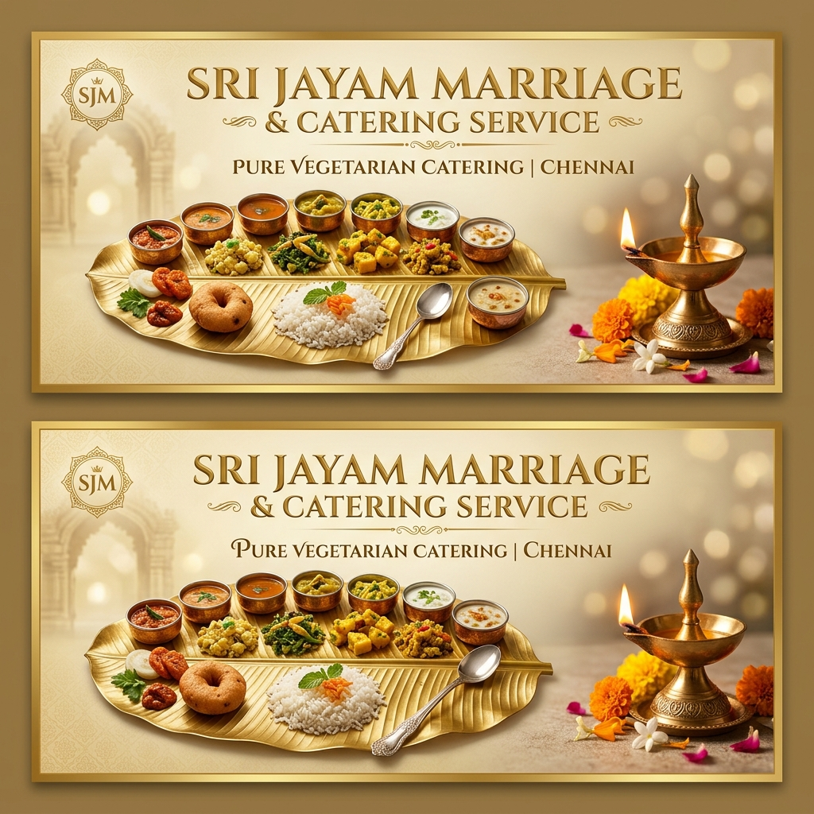

<p align="center">
  
</p>

<h1 align="center">🍽️ Sri Jayam Marriage & Catering Service</h1>

<p align="center">
  <strong>Pure Vegetarian Catering with Tradition & Excellence</strong>
</p>

<p align="center">
  <a href="https://react.dev/"></a>
  <a href="https://vite.dev/"></a>
  <a href="https://www.typescriptlang.org/"></a>
  <a href="https://tailwindcss.com/"></a>
  <a href="https://www.framer.com/motion/"></a>
  <a href="https://pages.github.com/"></a>
</p>

---

## 🌟 Overview

Welcome to the official repository for the **Sri Jayam Marriage & Catering Service** web application. 

Founded by **Mr. R. Viswanathan**, Sri Jayam Marriage Service has delivered premier pure vegetarian catering rooted in tradition, discipline, and sincere hospitality for over **30 years**. Serving families across Chennai, Pondicherry, and statewide Tamil Nadu, this web application is designed to showcase their premium catering services, traditional wedding arrangements, curated menu items, galleries of events, and client testimonials.

---

## ✨ Features

- 📱 **Fully Responsive Layout**: Built with a mobile-first design using Tailwind CSS, ensuring a seamless experience across smartphones, tablets, and desktops.
- 🍛 **Interactive Menu & Services**: Browse categorized food offerings (Traditional Meals, Starters & Snacks, Premium Buffet, Desserts, Beverages) and professional services (Wedding Catering, Corporate Events, Temple/Large Scale Functions).
- 🖼️ **Dynamic Gallery**: Categorized media view showcasing weddings, corporate food styling, and other catering events.
- 💫 **Smooth Micro-Animations**: Interactive buttons, cards, hover effects, and slide-ins powered by Framer Motion.
- 📞 **Event Booking Form**: Fully functional client intake form allowing event coordinators to choose the guest count, date, event type, and customized requirements.
- 🔍 **SEO & Metadata Optimization**: Dynamic search engine configuration using React Helmet Async to ensure high visibility and searchability.
- 🌓 **Day/Night Theme Support**: Clean aesthetic color coordination designed to appeal to clients.

---

## ⚙️ Tech Stack

- **Core Library**: [React 19](https://react.dev/)
- **Bundler & Dev Server**: [Vite 6](https://vite.dev/)
- **Programming Language**: [TypeScript](https://www.typescriptlang.org/)
- **Styling**: [Tailwind CSS v3](https://tailwindcss.com/) & [PostCSS](https://postcss.org/)
- **Animations**: [Framer Motion](https://www.framer.com/motion/)
- **Icons**: [Lucide React](https://lucide.dev/)
- **Routing**: [React Router DOM v7](https://reactrouter.com/)
- **Metadata Management**: [React Helmet Async](https://github.com/staylor/react-helmet-async)

---

## 📁 Directory Structure

```text
sri-jayam-catering-service-webapp/
├── public/                 # Static assets (Favicons, images, generated banner)
│   ├── assets/             # Sub-folders for service, slider, and testimonial images
│   └── banner.png          # Repository banner image
├── src/
│   ├── components/         # Reusable components
│   │   ├── layout/         # Header, Footer, and Page Layout wrappers
│   │   ├── seo/            # SEO configuration & React Helmet components
│   │   └── ui/             # Reusable UI widgets and buttons
│   ├── data/               # Static site configuration and menu items data
│   │   └── siteData.ts     # Main configurations, branches, and menus
│   ├── hooks/              # Custom React hooks
│   ├── pages/              # Routed pages (Home, About, Services, Menu, Gallery, Contact, Testimonials)
│   ├── App.tsx             # Main router and app layout configuration
│   ├── index.css           # Global CSS and Tailwind variables
│   └── main.tsx            # Application entrypoint
├── index.html              # Main HTML document template
├── package.json            # Node project configuration
├── tailwind.config.ts      # Tailwind CSS customization file
├── tsconfig.json           # TypeScript configuration
└── vite.config.ts          # Vite bundler configuration
```

---

## 🚀 Getting Started

### Prerequisites

Make sure you have Node.js installed on your machine. This repository is configured to use [pnpm](https://pnpm.io/) for dependency management.

### Installation

1. **Clone the repository:**
   ```bash
   git clone https://github.com/your-username/sri-jayam-catering-service-webapp.git
   cd sri-jayam-catering-service-webapp
   ```

2. **Install dependencies:**
   ```bash
   pnpm install
   ```

3. **Start the development server:**
   ```bash
   pnpm dev
   ```
   Open your browser and navigate to `http://localhost:5173` to see the site running live.

4. **Build the production bundle:**
   ```bash
   pnpm build
   ```

5. **Preview the production build locally:**
   ```bash
   pnpm preview
   ```

---

## 🌐 Deployment

The project is configured to easily deploy to **GitHub Pages** using the `gh-pages` utility package.

To deploy the production build to your GitHub Pages branch:
```bash
pnpm deploy
```
*Note: Make sure your `package.json` homepage URL is configured to point to your custom domain or GitHub user page repository path.*

---

## 🏛️ Office Branches

* **Main Branch (Chennai)**:  
  28/53, Naickamar Street, West Mambalam, Chennai – 600033
* **Pondicherry Branch**:  
  Plot No.29, Easwaran Koil Street, Marry Oulgraet, Pondicherry – 10

---

## 📝 License

This project is licensed under the MIT License - see the [LICENSE](./LICENSE) file for details.
